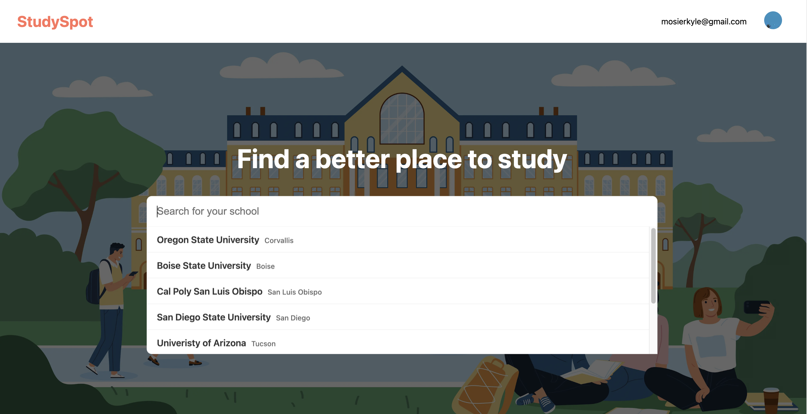

# StudySpot

### Link

[StudySpot](https://study-spot-five.vercel.app/)

### Description

Study Spot is a community-driven application designed to help students find the best study spots on their college campuses. With Study Spot, students can discover, share, and review study locations, making it easier to find the perfect environment for productivity.

### Features

- **Discover Study Spots:** Browse through a curated list of study spots uploaded by fellow students or search for specific locations by campus or amenities.
- **Share Study Spots:** Contribute to the community by uploading new study spots and providing details such as location, facilities, and photos.
- **Rate and Review::** Share your experiences and insights by leaving reviews and ratings for study spots you've visited, helping others make informed decisions.
- **Request New Campuses:** Expand or collapse individual nodes to reveal or hide nested data, providing a clear and organized view of the JSON structure.
- **User Profiles:** Create a personalized profile to keep track of your favorite study spots, reviews, and contributions.

### Tools Used

**Frontend:**

- [Next.js](https://nextjs.org/): A React framework for building server-rendered applications.
- [React](https://reactjs.org/): A JavaScript library for building user interfaces.
- [TypeScript](https://www.typescriptlang.org/): A statically-typed superset of JavaScript that provides better tooling and code quality.

**Backend:**

- Next.js API Routes: A simple way to create API endpoints within a Next.js application.

**Database:**

- [PostgreSQL](https://www.postgresql.org/): An open-source relational database management system, hosted serverlessly on Vercel.
- [Prisma](https://www.prisma.io/): An Object-Relational Mapping (ORM) tool for interacting with databases.

**Authentication:**

- [NextAuth.js](https://next-auth.js.org/): An authentication library for Next.js applications, supporting OAuth providers like Google.

**Mapping:**

- [Mapbox API](https://www.mapbox.com/): A powerful mapping platform for creating interactive maps and visualizations.

**Hosting:**

- [Vercel](https://vercel.com/): A cloud platform for static and serverless deployment, used for hosting the application.

**Storage:**

- [AWS S3](https://aws.amazon.com/s3/): Amazon Web Services' highly scalable and reliable cloud storage service, used for storing user-uploaded images.

**Secruity:**

- [bcrypt](https://github.com/kelektiv/node.bcrypt.js): A library for hashing and salting passwords securely.

### Installation

1. **Prerequisites:** Ensure you have Node.js and npm (Node Package Manager) installed on your system.

2. **Clone the Repository:**

   ```
   git clone https://github.com/mosierkyle/study-spot
   ```

3. **Install Dependencies:**

   ```
   npm install
   ```

4. **Start the Development Server:**

   ```
   npm run dev
   ```

   This will start the development server, and the application will be available at `http://localhost:3000` in your web browser.

### Previews





